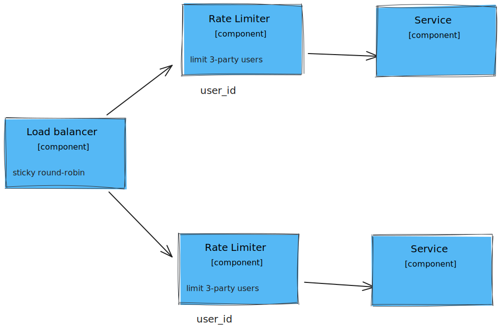

# Rate-Limiter

## General information

### Client Identification

1. IP based: can block users with same public IP address.
2. User id based: won’t work on services, that doesn’t require authentication
3. Solution: Hybrid, IP based where no authentication and User id based where authentication enabled.

I chose User id based, for demonstration purpose.

### Algorithm choice

1. Fixed Window: simple but susceptible to “thundering herd” at window boundaries
2. Sliding Window: higher memory consumption, accurate across window boundaries, smooth rate control
3. Token Bucket: requires token management, would take too long to implement for endterm

So, I chose sliding window

### Storage

Store data in memory, it is possible to use in memory cache, or just store in service’s memory as I did. 

## Explaining my approach

## Algortihm

1. Identify client based on the “X-User-ID” header from request
2. Record timestamp of each request, map to users
3. Purge list before recording new timestamp, delete timestamps older than window size.
4. Check if requests number exceeded max requests, if so send 429 to user
5. Otherwise let request reach endpoint 

## Configuration

I used window size of 5 seconds and 3 requests max, to test. Which means that there can be only 3 requests in 5 seconds. Real configuration would depend on the system load, and too specific for each system.

## Scaling

How to scale? Add more instances with load balancer, where load balancer uses sticky round robin:




---

### How to test:

```bash
curl -H "X-User-ID: me" http://localhost:8003/api/example
```